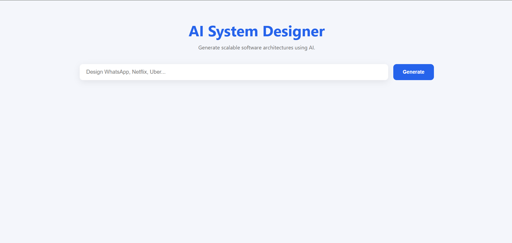
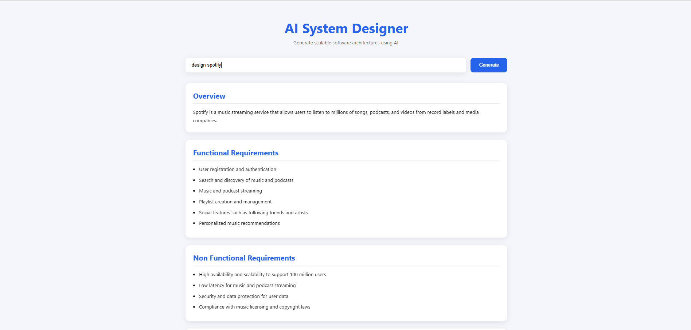
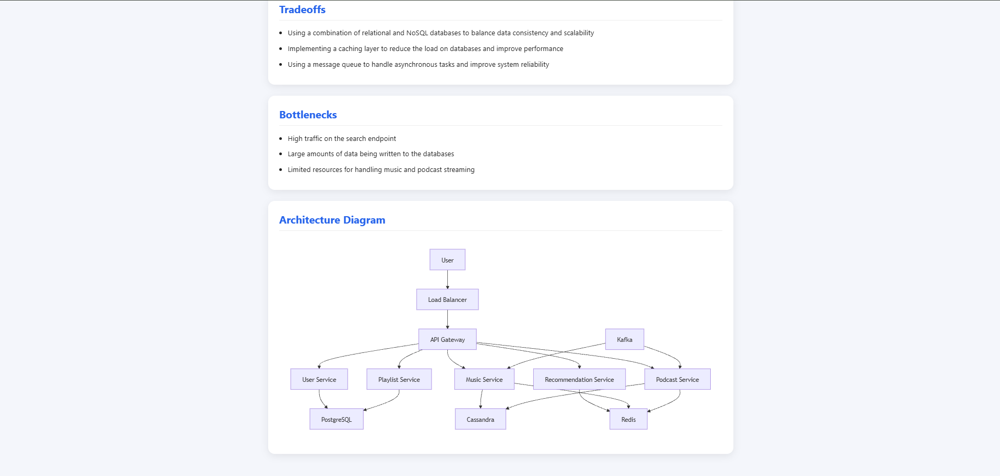
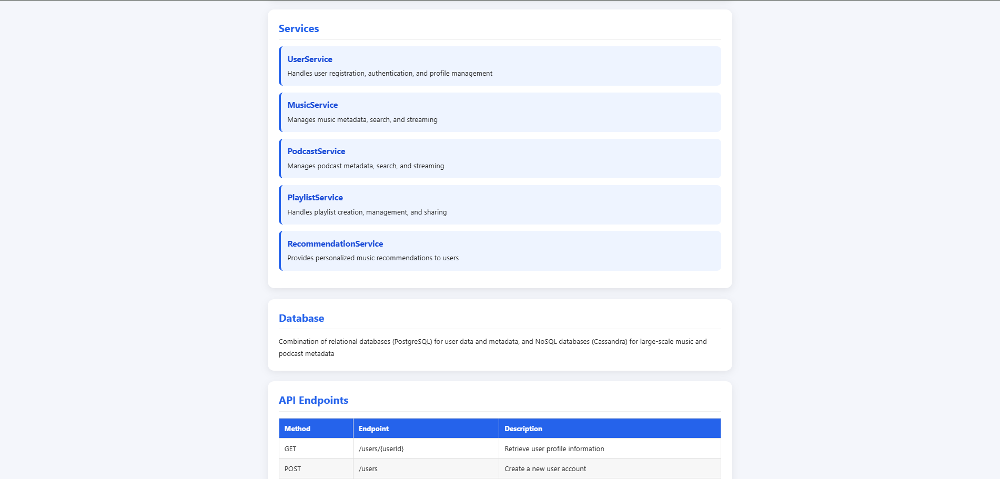

# 🏗️ AI System Designer

> Transform natural language prompts into scalable software architectures using AI.

An AI-powered system design generator that creates production-ready software architectures, functional requirements, REST APIs, database recommendations, caching strategies, message queue suggestions, and interactive Mermaid diagrams from a single prompt.

Built using **React**, **FastAPI**, **Groq LLM**, and **Mermaid.js**.

---

## 🚀 Features

- 🧠 AI-generated system architecture
- 📋 Functional & Non-Functional Requirements
- 🏛️ Service decomposition
- 🗄️ Database recommendations
- 🔌 REST API generation
- ⚡ Caching strategy suggestions
- 📨 Message Queue recommendations
- 📊 Interactive Mermaid architecture diagrams
- ⚖️ Trade-offs and bottleneck analysis
- 🎨 Clean and responsive UI

---

# 🖼️ Screenshots

## Home Page

<p align="center">
  
</p>

---

## Generated System Design

<p align="center">
  
</p>

---

## Architecture Diagram

<p align="center">
  
</p>

---

## Complete Output

<p align="center">
  
</p>

---

# 🎥 Demo

> *(Optional)*

<p align="center">
  
</p>

---

# 🛠️ Tech Stack

## Frontend

- React
- Axios
- Mermaid.js
- CSS

## Backend

- FastAPI
- Python
- Pydantic
- Groq API
- Uvicorn

## AI

- Groq LLM
- Prompt Engineering

---

# ⚙️ Installation

## Clone Repository

```bash
git clone https://github.com/hansiddhgurram/ai-system-designer.git
cd ai-system-designer
```

---

## Backend Setup

```bash
cd backend

python -m venv venv
```

### Windows

```bash
venv\Scripts\activate
```

### Linux / macOS

```bash
source venv/bin/activate
```

Install dependencies

```bash
pip install -r requirements.txt
```

Create a `.env`

```env
GROQ_API_KEY=your_api_key
MODEL_NAME=llama-3.3-70b-versatile
```

Run backend

```bash
uvicorn app:app --reload
```

Backend runs on

```
http://127.0.0.1:8000
```

---

## Frontend Setup

```bash
cd frontend

npm install
npm run dev
```

Frontend runs on

```
http://localhost:5173
```

---

# 💡 Example Prompts

```
Design WhatsApp
```

```
Design Uber
```

```
Design Netflix
```

```
Design Instagram
```

```
Design YouTube
```

```
Design Amazon
```

---

# 📂 Project Structure

```
ai-system-designer/

├── backend/
│   ├── routes/
│   ├── services/
│   ├── models/
│   ├── utils/
│   ├── app.py
│   └── requirements.txt
│
├── frontend/
│   ├── src/
│   ├── public/
│   └── package.json
│
├── screenshots/
│
└── README.md
```

---

# 📈 Example Output

The AI generates:

- Project Overview
- Functional Requirements
- Non Functional Requirements
- High Level Architecture
- Services
- Database Design
- REST APIs
- Cache Strategy
- Message Queue
- Trade-offs
- Bottlenecks
- Mermaid Architecture Diagram

---

# 🔮 Future Improvements

- AWS architecture recommendations
- Kubernetes deployment generation
- Export to PDF
- Export to Markdown
- Interactive architecture editor
- Multiple LLM support
- Authentication
- Save design history
- Download Mermaid diagrams
- Architecture comparison mode

---

# 🤝 Contributing

Contributions are welcome!

1. Fork the repository
2. Create a feature branch

```bash
git checkout -b feature-name
```

3. Commit your changes

```bash
git commit -m "Added new feature"
```

4. Push your branch

```bash
git push origin feature-name
```

5. Open a Pull Request

---

# 📜 License

This project is licensed under the MIT License.

---

# 👨‍💻 Author

**Hansiddh G**

- GitHub: https://github.com/hansiddhgurram
- LinkedIn: *(Add your LinkedIn URL here)*

---

## ⭐ If you found this project useful, consider giving it a star!